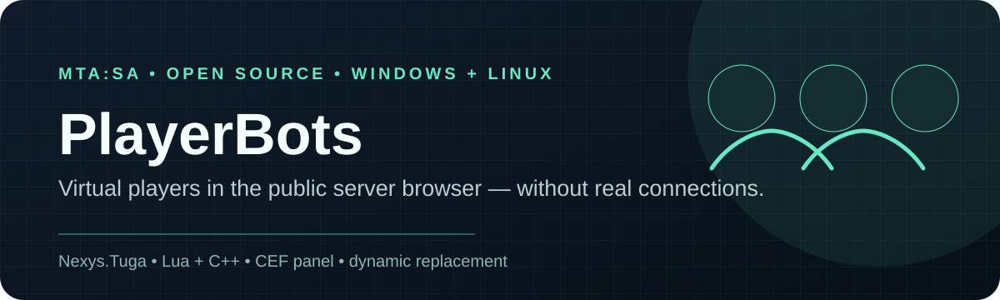

<p align="center">
  
</p>

<p align="center">
  
  
  
  
</p>

<h1 align="center">PlayerBots</h1>

<p align="center">
  Jogadores virtuais open-source para o browser de servidores do <strong>Multi Theft Auto: San Andreas</strong>.<br>
  Desenvolvido por <strong>Nexys.Tuga</strong>.
</p>

O PlayerBots permite a um servidor anunciar um conjunto configurável de jogadores virtuais no browser do MTA. A contagem do browser, a lista de nomes de jogadores visível e a verificação interna `PingStatus` do MTA são mantidas coerentes, para que clientes MTA normais consigam ver a mesma contagem pública sem instalar um cliente modificado.

O sistema **não** cria ligações reais de jogadores, não adiciona elementos a `getElementsByType("player")` e não ocupa sessões de rede reais. O que altera são as respostas ASE utilizadas pelo browser.

> **Importante:** os módulos nativos são deliberadamente fail-closed e estão associados às builds de `net.dll` / `net.so` que foram testadas. Não reutilizes o offset fixo do encoder numa build diferente do MTA sem primeiro fazer o port e os testes necessários.

[English README →](./README.md)

A documentação em inglês e em PT-PT é mantida com o mesmo âmbito técnico e o mesmo nível de detalhe. As páginas de plataforma e a documentação técnica também têm uma versão PT-PT correspondente.

---

## Funcionalidades

- Contagem pública no browser: jogadores reais + jogadores virtuais.
- Nomes virtuais apresentados na lista de jogadores do browser.
- Três modos de nomes:
  - nomes aleatórios a partir de `names.lua`;
  - nomes específicos selecionados a partir de `names.lua`;
  - nomes personalizados, separados por vírgulas, introduzidos no painel.
- Base pública de nomes vazia por defeito: acrescenta apenas os nomes que pretendes utilizar.
- Modo de substituição dinâmica: os jogadores reais podem substituir jogadores virtuais, um a um, depois de ser atingido um total configurado.
- Painel de administração CEF aberto através de `/playerbots`.
- Comando protegido por ACL: `command.playerbots`.
- API de servidor exportada para scoreboards ou outros resources.
- Implementações nativas para Windows x86 e Linux x64 incluídas em código-fonte.
- Sem telemetria nem dependência de serviços externos.

## Exemplo do comportamento de substituição

Configuração:

```text
Objetivo virtual: 20
Substituir ao total: 25
```

Com 5 jogadores reais, a contagem pública é 25 (`5 + 20`). Quando entra um sexto jogador real, desaparece um jogador virtual, pelo que a contagem pública se mantém em 25 (`6 + 19`). Se entrar outro jogador real, passa a `7 + 18`, e assim sucessivamente. Quando jogadores reais saem, os jogadores virtuais são repostos automaticamente até ao objetivo configurado.

---

## Estrutura do repositório

```text
PlayerBots/
├── README.md
├── README.pt-PT.md
├── LICENSE
├── assets/
│   └── playerbots-banner.svg
├── resource/
│   └── playerbots/
│       ├── meta.xml
│       ├── names.lua
│       ├── server.lua
│       ├── client.lua
│       └── ui/
│           ├── index.html
│           ├── app.js
│           └── style.css
├── platforms/
│   ├── windows-x86/
│   │   ├── playerbots_native_windows_x86.cpp
│   │   ├── build_x86.bat
│   │   ├── verify_net.ps1
│   │   ├── README.md
│   │   └── README.pt-PT.md
│   └── linux-x64/
│       ├── playerbots_native_linux_x64.cpp
│       ├── build_linux_x64.sh
│       ├── verify_net.sh
│       ├── README.md
│       └── README.pt-PT.md
└── docs/
    ├── ARCHITECTURE.md
    ├── ARCHITECTURE.pt-PT.md
    ├── DEVELOPMENT-JOURNEY.md
    ├── DEVELOPMENT-JOURNEY.pt-PT.md
    ├── TROUBLESHOOTING.md
    └── TROUBLESHOOTING.pt-PT.md
```

---

## Compatibilidade

### Windows x86

A implementação para Windows foi testada exatamente com este fingerprint de `net.dll`:

```text
MTA net version: 1.6.0-9.24035.0
SHA-256: 4293afc3e1725c52d95409ee585b45ed487cd3d397ff7ff1bfdb4786bd067659
PE TimeDateStamp: 0x6AADC98B
SizeOfImage: 0x00221000
Checksum: 0x002036FC
```

O módulo valida o fingerprint PE e a assinatura de instruções antes de utilizar o encoder. Se não corresponder, o encoder permanece desativado.

### Linux x64

A implementação para Linux foi testada com:

```text
MTA net version: 1.6.0-9.23312.0
SHA-256: 39d4a4f1b0b5c51ca792dc45f134c695e9083ea6ca266d61a2c3e4e085fcb56d
```

O módulo verifica `GetLibMtaVersion` e uma pequena assinatura de instruções antes de utilizar o encoder.

Se a tua build for diferente, consulta [Portar para outra build do MTA](#portar-para-outra-build-do-mta).

---

## Instalação

### 1. Instalar o resource

Copia:

```text
resource/playerbots/
```

para a pasta de resources do teu MTA e mantém o nome do resource como:

```text
playerbots
```

Depois atualiza/inicia normalmente:

```text
refresh
start playerbots
```

### 2. Compilar e instalar o módulo nativo

#### Windows x86

Requisitos:

- Visual Studio com a carga de trabalho de desenvolvimento de desktop em C++.
- Ferramentas de compilação MSVC x86.

Abre uma Developer Command Prompt em:

```text
platforms/windows-x86/
```

e executa:

```text
build_x86.bat
```

Resultado:

```text
build\playerbots_native.dll
```

Copia-o para a pasta de módulos x86, normalmente:

```text
server\mods\deathmatch\modules\playerbots_native.dll
```

#### Linux x64

Requisitos:

```text
g++
libdl
```

Executa:

```bash
cd platforms/linux-x64
chmod +x build_linux_x64.sh
./build_linux_x64.sh
```

Resultado:

```text
build/playerbots_native.so
```

Copia-o para:

```text
x64/modules/playerbots_native.so
```

### 3. Carregar o módulo

Adiciona o módulo adequado ao `mtaserver.conf`:

Windows:

```xml
<module src="playerbots_native.dll" />
```

Linux:

```xml
<module src="playerbots_native.so" />
```

Reinicia o servidor MTA depois de alterar módulos nativos.

### 4. Conceder acesso ao painel

O comando é restringido pela ACL do MTA através de:

```text
command.playerbots
```

Concede esse direito apenas aos grupos ACL que devem poder configurar o PlayerBots.

### 5. Adicionar nomes

A versão pública é distribuída intencionalmente com um `names.lua` vazio:

```lua
PLAYERBOTS_NAMES = {
}
```

Acrescenta as tuas próprias entradas:

```lua
PLAYERBOTS_NAMES = {
    "Alex Silva",
    "Jordan Miles",
    "Sam Costa",
}
```

Em alternativa, seleciona **Nomes personalizados** no painel e introduz os nomes separados por vírgulas.

---

## Painel

Executa:

```text
/playerbots
```

O painel permite a um administrador autorizado configurar:

- estado ativado/desativado;
- objetivo de jogadores virtuais;
- nomes aleatórios, específicos ou personalizados;
- limite de substituição dinâmica;
- se a lista virtual é exposta através de element data para scoreboards compatíveis.

As definições são guardadas em `settings.json`, no armazenamento privado e gravável do resource.

---

## API do servidor

O resource exporta:

```lua
exports.playerbots:getPublicPlayerCount()
exports.playerbots:getVirtualPlayerCount()
exports.playerbots:getVirtualPlayers()
exports.playerbots:isPlayerBotsEnabled()
```

Também publica estas chaves de element data no `root`:

```text
playerbots:enabled
playerbots:realPlayers
playerbots:virtualPlayers
playerbots:publicPlayers
playerbots:maxPlayers
playerbots:bots
playerbots
```

Exemplo:

```lua
local total = exports.playerbots:getPublicPlayerCount()
local bots = exports.playerbots:getVirtualPlayers()
```

---

## Como funciona

O browser do MTA recebe respostas de consulta ASE. Alterar apenas a contagem visível no EYE2 não é suficiente: posteriormente, o cliente chama `UpdatePingStatus`, que verifica/reconstrói a contagem de jogadores a partir do bloco `PingStatus` do servidor.

Por isso, o PlayerBots mantém três partes coerentes:

1. a contagem numérica de jogadores ASE;
2. a lista de nomes dos jogadores;
3. um `PingStatus` gerado pelo encoder original do módulo de rede MTA carregado, mas utilizando o total público (`reais + virtuais`).

O módulo nativo interceta o caminho de saída ASE em `sendto`, reescreve apenas formatos de resposta EYE reconhecidos e deixa pacotes desconhecidos inalterados.

Consulta [Arquitetura](./docs/ARCHITECTURE.pt-PT.md) para o fluxo detalhado.

---

## Portar para outra build do MTA

**Não** alteres cegamente o RVA fixo do encoder.

Um port correto deve:

1. identificar a versão exata e o SHA-256 de `net.dll` / `net.so`;
2. localizar o caminho do encoder de `GetPingStatus` para essa build;
3. determinar a ABI do encoder e o formato da string de saída;
4. acrescentar uma validação rigorosa por fingerprint/assinatura;
5. testar com 0, 1 e vários jogadores reais;
6. validar o resultado final num cliente MTA não modificado;
7. confirmar que entradas e saídas de jogadores reais mantêm a contagem pública coerente.

Os sources das plataformas existentes servem como referência, não como offsets universais.

---

## Notas de desenvolvimento

Este projeto passou por várias iterações porque a primeira implementação parecia correta ao nível do pacote, mas o browser original continuava a corrigir a contagem apresentada para o número real. Uma build de diagnóstico do cliente mostrou a transição exata:

```text
QUERY PRE  players=12
QUERY POST players=1
```

Isso reduziu o problema a `UpdatePingStatus`. A abordagem final deixou de falsificar apenas a contagem EYE2 e passou a reutilizar o encoder original da rede MTA para criar um `PingStatus` correspondente ao total público.

A cronologia técnica completa está documentada em [Percurso de desenvolvimento](./docs/DEVELOPMENT-JOURNEY.pt-PT.md).

---

## Notas de segurança e operação

- Faz backups antes de testar um módulo nativo num servidor de produção.
- Um offset nativo incompatível pode provocar crash no servidor; as builds incluídas utilizam validações de versão/assinatura precisamente por esse motivo.
- Não publiques passwords, API keys ou outros segredos num repositório de resources.
- O PlayerBots altera apenas a apresentação no browser de servidores; não deve ser utilizado como substituto de métricas de atividade real do servidor.

---

## Apoio e reporte de bugs

Se encontrares um bug, uma incompatibilidade com outra build do MTA ou alguma parte da documentação que não esteja clara, podes:

- abrir uma issue no [repositório MTA](https://github.com/NexysT/MTA/issues) e colocar `[PlayerBots]` no início do título;
- contactar **Nexys.Tuga** no Discord: `nobody_0101010101001`.

Ao reportares um problema no módulo nativo, inclui o sistema operativo, a versão do MTA Server, a arquitetura, o SHA-256 de `net.dll` / `net.so` e a parte relevante da consola do servidor. Isso torna problemas específicos de uma build muito mais fáceis de reproduzir.

---

## Licença

MIT. Consulta [LICENSE](./LICENSE).

Multi Theft Auto é um projeto separado. O PlayerBots é um projeto comunitário independente e não é afiliado nem apoiado oficialmente pela equipa do MTA.
