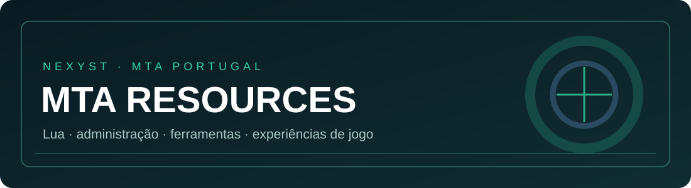

<p align="center">
  
</p>

<p align="center">
  
  
  
  <a href="https://github.com/NexysT"></a>
</p>

<h1 align="center">MTA Portugal</h1>

<p align="center">
  Os recursos em que vou trabalhando para o <strong>Multi Theft Auto: San Andreas</strong>, reunidos no mesmo sítio.
</p>

Este repositório é a minha forma de ter os projetos do MTA Portugal organizados sem misturar tudo numa pasta gigante. Cada recurso tem a sua própria página, com uma explicação do que faz, os ficheiros necessários e instruções para o instalar. Assim, quem chega aqui pela primeira vez consegue perceber o que está a descarregar antes de o meter no servidor.

Começo pelo painel de administração, que foi o recurso que andei a alterar: traduzi a interface para PT-PT e fui-lhe acrescentando ferramentas para a gestão e para o desenvolvimento do servidor.

---

## O que já está aqui?

### [Painel Administração | MTA Portugal →](./Painel-Administracao-MTA-Portugal/)

É uma versão adaptada do painel `admin` do MTA, com as funcionalidades tradicionais e algumas coisas que me faziam falta no dia a dia:

- Interface em português de Portugal, com menus e botões ajustados ao espaço do painel.
- Consulta de jogadores, ações administrativas, recursos, mapas, banimentos e opções do servidor.
- **Depuração:** uma aba para acompanhar avisos, erros e mensagens recebidas pelo painel, sem andar sempre a trocar de janela.
- **Comandos:** selecionas um resource e consultas os comandos que estão registados.
- **ACL:** uma forma mais visual de trabalhar com cargos, contas e permissões, sem depender apenas da janela tradicional de ACL.
- **Admin anónimo:** nas ações abrangidas por este modo, as mensagens públicas não identificam quem as executou. O registo interno continua a guardar a identidade do administrador.

**[Ver o painel, conhecer as funcionalidades e ler a instalação →](./Painel-Administracao-MTA-Portugal/)**

---

## Quero descarregar um recurso. Onde carrego?

Se só queres experimentar o painel, começa pela [página do Admin](./Painel-Administracao-MTA-Portugal/). Tens lá a estrutura dos ficheiros, a instalação passo a passo e os cuidados a ter com as permissões.

No GitHub, também podes usar o botão verde **Code → Download ZIP**. Esse botão descarrega **o repositório inteiro**, não só o painel. Depois de extraires, entra em `Painel-Administracao-MTA-Portugal/admin/`: é essa pasta `admin` que interessa ao servidor MTA.

> Não é preciso mudar o nome do resource para «Painel Administração». Esse é o nome da página no GitHub; no jogo, o resource continua a chamar-se `admin`.

## Porque é que os scripts se chamam `.lua`?

É normal. Os scripts da versão publicada foram preparados em formato compilado; conservaram a extensão `.lua` para não obrigar a alterar os caminhos do `meta.xml`. A extensão do ficheiro não te diz, por si só, se o conteúdo é código-fonte legível.

A compilação e a ofuscação tornam a leitura e a reutilização direta do código mais difíceis, mas não são uma garantia de que ninguém o consiga analisar. Não publiques passwords, tokens ou outros segredos dentro de um resource, mesmo quando os scripts estão compilados.

---

## Como está organizado?

```text
MTA/
├── README.md                         ← esta página
├── assets/
│   └── mta-banner.svg                ← imagem do repositório
└── Painel-Administracao-MTA-Portugal/
    ├── README.md                     ← página e instruções do painel
    ├── LICENSE-MTA.txt               ← licença da base original
    └── admin/                         ← resource para o servidor
        ├── meta.xml
        ├── admin_definitions.lua
        ├── client/
        ├── server/
        ├── conf/
        └── ...
```

Quando acrescentar outros recursos, ficam ao lado de `Painel-Administracao-MTA-Portugal/`, cada um com a sua documentação. Não ficam misturados com o código do Admin.

---

## Créditos

O painel parte de um recurso já existente no [projeto oficial mtasa-resources](https://github.com/multitheftauto/mtasa-resources), e não de um painel escrito integralmente do zero. Os créditos e a licença MIT da base original estão na [página do Admin](./Painel-Administracao-MTA-Portugal/).

As alterações, a tradução e as novas ferramentas aqui apresentadas fazem parte do trabalho desenvolvido para o **MTA Portugal (NexysT)**.

<p align="center">
  <a href="https://github.com/NexysT"><strong>Voltar ao meu perfil no GitHub ↗</strong></a>
</p>
<p align="center"><sub>NexysT · MTA Portugal · PT-PT</sub></p>
