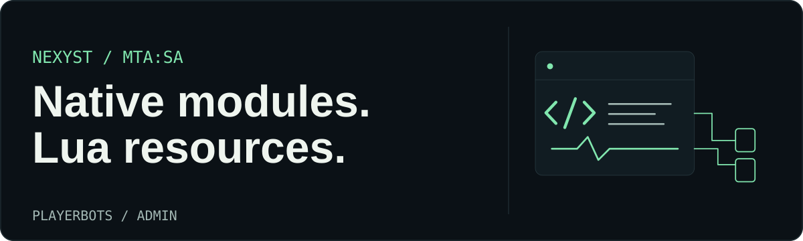

<picture>
  <source media="(max-width: 600px)" srcset="./assets/mta-banner-mobile.svg">
  
</picture>


[Português](./README.md) · [English](./README.en.md)

# MTA:SA — recursos e integração nativa

Projetos de **NexysT** para o **Multi Theft Auto: San Andreas**, com documentação e ficheiros organizados por recurso. O destaque é **PlayerBots**: módulos nativos em C++ e integração Lua com o browser de servidores, acompanhados por um painel de administração adaptado para o MTA Portugal.

## PlayerBots

### [Integração nativa com o browser do MTA:SA →](./PlayerBots/)

O PlayerBots apresenta jogadores virtuais no browser público do MTA sem criar ligações reais ao servidor. Mantém coerentes a contagem pública, a lista de nomes e o `PingStatus` utilizado pelo cliente original.

- **C++ + Lua:** módulos nativos, resource e painel CEF.
- **Windows x86 / Linux x64:** implementações distintas, com hooking de `sendto` por IAT ou PLT/GOT.
- **Análise low-level e debugging:** investigação de ASE/EYE2 e da verificação `UpdatePingStatus`, instrumentação do cliente MTA e reutilização do encoder de rede original.
- **Configuração:** nomes aleatórios, específicos ou personalizados; jogadores reais podem substituir virtuais um a um através do modo dinâmico.
- **Código e documentação:** fontes, scripts de compilação por plataforma e documentação técnica sobre arquitetura, compatibilidade e portabilidade.

> Os módulos nativos estão associados às builds testadas de `net.dll` / `net.so`. A utilização noutra build exige port e testes; as validações de versão/fingerprint e assinatura protegem o acesso ao encoder.

**[Código, compatibilidade e instalação](./PlayerBots/)** · [Arquitetura](./PlayerBots/docs/ARCHITECTURE.pt-PT.md) · [Percurso de desenvolvimento](./PlayerBots/docs/DEVELOPMENT-JOURNEY.pt-PT.md)

## Painel de administração

### [Painel Administração | MTA Portugal →](./Painel-Administracao-MTA-Portugal/)

Versão adaptada do resource `admin` do MTA. A interface foi traduzida e foram acrescentadas ferramentas para a gestão e o desenvolvimento do servidor:

- Interface em português, com menus e botões ajustados ao espaço do painel.
- Consulta de jogadores, ações administrativas, recursos, mapas, banimentos e opções do servidor.
- **Depuração:** aba para acompanhar avisos, erros e mensagens recebidas pelo painel.
- **Comandos:** seleção de um resource e consulta dos comandos registados.
- **ACL:** gestão visual de cargos, contas e permissões.
- **Admin anónimo:** nas ações abrangidas, as mensagens públicas não identificam quem as executou; o registo interno conserva a identidade do administrador.

**[Funcionalidades, instalação e permissões →](./Painel-Administracao-MTA-Portugal/)**

## Descarregar e instalar

Abre primeiro a página do projeto que queres experimentar:

- [PlayerBots](./PlayerBots/): código-fonte, compilação dos módulos nativos, compatibilidade por plataforma e instalação do resource.
- [Painel Administração](./Painel-Administracao-MTA-Portugal/): estrutura, instalação e cuidados com permissões.

No GitHub, **Code → Download ZIP** descarrega **o repositório inteiro**. Para instalar o painel, extrai o ZIP e utiliza a pasta:

```text
Painel-Administracao-MTA-Portugal/admin/
```

O resource continua a chamar-se `admin` no servidor; não o renomeies para «Painel Administração». Para o PlayerBots, segue os passos próprios de compilação e instalação na respetiva página.

### Scripts compilados do painel

Os scripts da versão publicada do painel foram preparados em formato compilado e conservaram a extensão `.lua`, para manter os caminhos do `meta.xml`. A extensão do ficheiro não indica, por si só, se o conteúdo é código-fonte legível.

A compilação e a ofuscação dificultam a leitura e a reutilização direta do código, mas não garantem que ninguém o consiga analisar. Não publiques passwords, tokens ou outros segredos dentro de um resource, mesmo quando os scripts estão compilados.

## Organização e origem

```text
MTA/
├── README.md
├── README.en.md
├── assets/
│   └── mta-banner.svg
├── PlayerBots/
│   ├── README.md
│   ├── README.pt-PT.md
│   ├── LICENSE
│   ├── resource/playerbots/
│   ├── platforms/
│   │   ├── windows-x86/
│   │   └── linux-x64/
│   └── docs/
└── Painel-Administracao-MTA-Portugal/
    ├── README.md
    ├── LICENSE-MTA.txt
    └── admin/
        ├── meta.xml
        ├── admin_definitions.lua
        ├── client/
        ├── server/
        ├── conf/
        └── ...
```

Cada recurso mantém a sua documentação e os seus ficheiros na própria pasta. Novos recursos ficam ao lado dos existentes, sem misturar o respetivo código.

O painel deriva do resource `admin` do [projeto oficial mtasa-resources](https://github.com/multitheftauto/mtasa-resources). Os créditos e a licença MIT da base original estão na [página do painel](./Painel-Administracao-MTA-Portugal/). As alterações, a tradução e as novas ferramentas foram desenvolvidas para o **MTA Portugal (NexysT)**.

O PlayerBots é um projeto comunitário independente, com [licença MIT](./PlayerBots/LICENSE) e documentação própria. Não é afiliado nem apoiado oficialmente pela equipa do MTA.

[Perfil NexysT ↗](https://github.com/NexysT)

